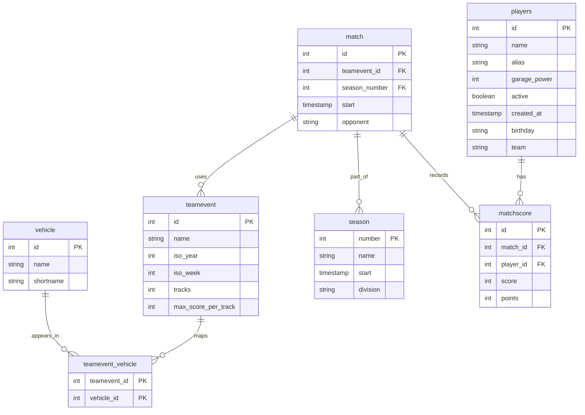
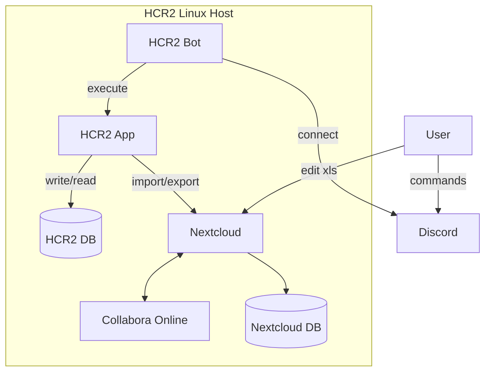

# DB Schema

```mermaid
erDiagram

players {
    int id PK
    string name
    string alias
    int garage_power
    boolean active
    timestamp created_at
    string birthday
    string team
}

vehicle {
    int id PK
    string name
    string shortname
}

teamevent {
    int id PK
    string name
    int iso_year
    int iso_week
    int tracks
    int max_score_per_track
}

teamevent_vehicle {
    int teamevent_id PK
    int vehicle_id PK
}

season {
    int number PK
    string name
    timestamp start
    string division
}

match {
    int id PK
    int teamevent_id FK
    int season_number FK
    timestamp start
    string opponent
}

matchscore {
    int id PK
    int match_id FK
    int player_id FK
    int score
    int points
}

players ||--o{ matchscore : has
match ||--o{ matchscore : records
match ||--o{ teamevent : uses
match ||--o{ season : part_of
teamevent ||--o{ teamevent_vehicle : maps
vehicle ||--o{ teamevent_vehicle : appears_in
```

```mermaid
flowchart TD
    USER[User]
    DISCORD[Discord]

    subgraph HCR2 Linux Host
        BOT[HCR2 Bot]
        APP[HCR2 App]
        DB[(HCR2 DB)]
        NC[Nextcloud]
        COL[Collabora Online]
        SQL[(Nextcloud DB)]

        BOT -- execute --> APP
        APP -- write/read --> DB
        APP -- import/export --> NC
        NC <--> COL
        NC --> SQL
    end

    USER -- commands --> DISCORD
    USER -- edit xls --> NC
    BOT -- connect --> DISCORD
```
