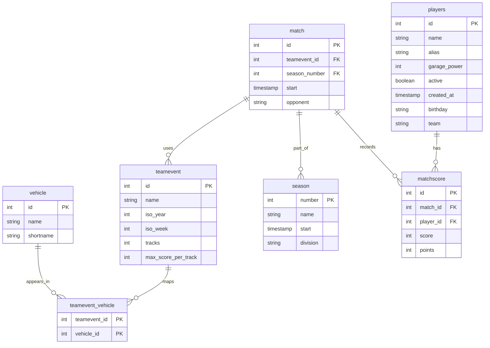
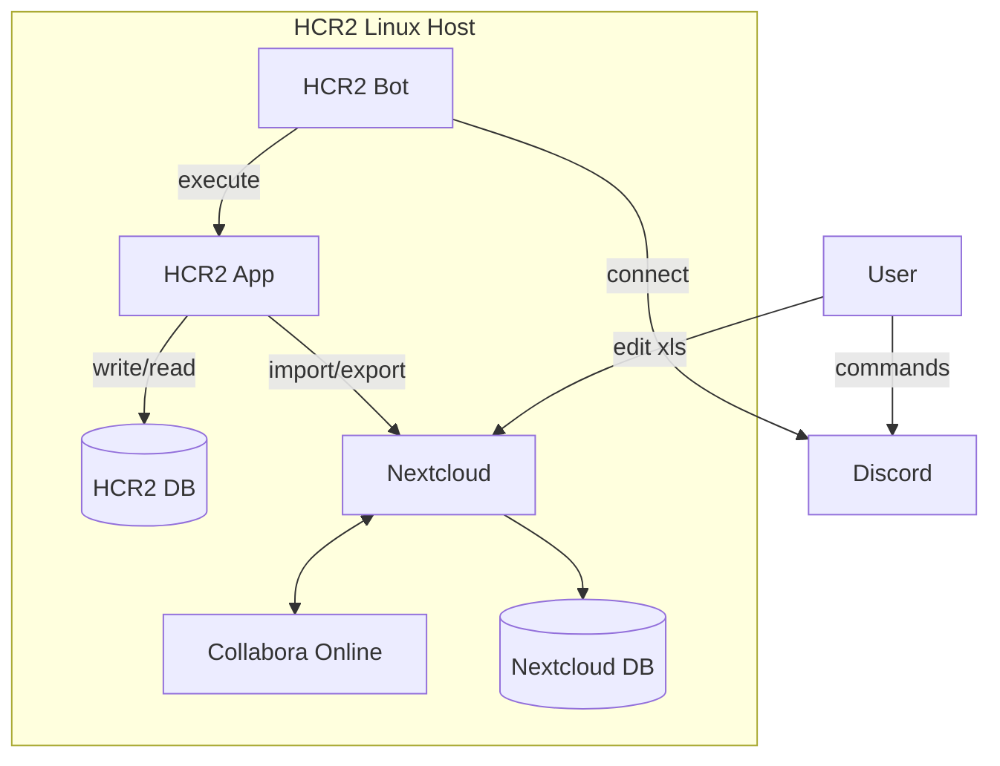

# CLI Conventions

The project now follows a preferred CLI style. Older positional forms still work for compatibility, but new commands and docs should follow these rules:

- Use flags for filters and optional values: `--all`, `--season`, `--division`, `--team`, `--date`
- Use `--id <id>` as the preferred selector for single-record operations, even if `<id>` still works as a legacy alias
- Prefer `add` and `edit` with named flags for multi-field commands
- Keep `delete` in the form `delete --id <id>`
- Keep help text structured as `Usage` plus `Commands`
- Treat older positional-only forms as legacy compatibility, not the preferred public style

Examples:

```bash
python hcr2.py player show --id 1
python hcr2.py match list --season 62
python hcr2.py donations add --player 1 --date 2026-06-04 --total 12345
python hcr2.py teamevent add --name "Teamcup" --week 2026/W23 --tracks 4 --score 15000
```

## Bash Completion

For the current shell:

```bash
source completions/hcr2.bash
```

For a persistent per-user install:

```bash
mkdir -p ~/.local/share/bash-completion/completions
cp completions/hcr2.bash ~/.local/share/bash-completion/completions/hcr2.py
```

Then complete `./hcr2.py` or `hcr2.py` with Tab.

# DB Schema





