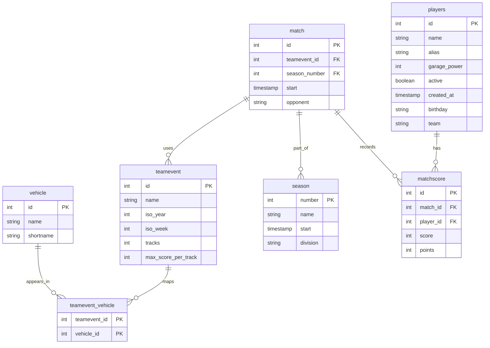
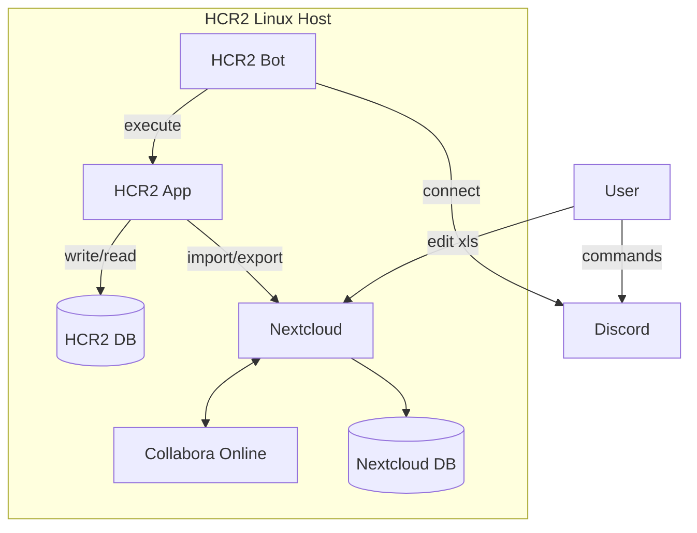

# CLI Conventions

The project now follows a preferred CLI style. Older positional forms still work for compatibility, but new commands and docs should follow these rules:

- Use flags for filters and optional values: `--all`, `--season`, `--division`, `--team`, `--date`
- Use `--id <id>` as the preferred selector for single-record operations, even if `<id>` still works as a legacy alias
- Prefer `add` and `edit` with named flags for multi-field commands
- Keep `delete` in the form `delete --id <id>`
- Keep help text structured as `Usage` plus `Commands`
- Treat older positional-only forms as legacy compatibility, not the preferred public style

Examples:

```bash
python3 -m hcr2 player show --id 1
python3 -m hcr2 match list --season 62
python3 -m hcr2 donations add --player 1 --date 2026-06-04 --total 12345
python3 -m hcr2 teamevent add --name "Teamcup" --week 2026/W23 --tracks 4 --score 15000
```

The legacy `python3 hcr2.py ...` form remains available as a compatibility
entry point.

## Bash Completion

For the current shell:

```bash
source completions/hcr2.bash
```

For a persistent per-user install:

```bash
mkdir -p ~/.local/share/bash-completion/completions
cp completions/hcr2.bash ~/.local/share/bash-completion/completions/hcr2
```

Then complete `hcr2`, `./hcr2.py` or `hcr2.py` with Tab, depending on how you
invoke the command.

## Tests

Run the full test suite with the standard library test runner:

```bash
python3 -m unittest discover -v
```

The tests use temporary SQLite databases created through the migration runner.
They are split by area:

```text
tests/support.py             shared temporary database fixture
tests/test_cli_help.py       CLI help, version and dispatch behavior
tests/test_core_domains.py   vehicle, season, match and team event basics
tests/test_donations.py      donations CLI smoke behavior
tests/test_matchscores.py    matchscore repository and service behavior
tests/test_players.py        player repository and service behavior
tests/test_sheets.py         sheet import/export services and workflows
tests/test_stats.py          stats repository, service and CLI smoke behavior
tests/test_output.py         formatting and workbook output helpers
tests/test_migrations.py     migration runner behavior
tests/test_nextcloud.py      Nextcloud path helpers
```

## Project Layout

The incremental refactor keeps `hcr2.py` as the compatibility entry point and
adds a package entry point that can also be run with `python3 -m hcr2`.

```text
hcr2/
  cli/             command dispatch and future CLI implementation
  exporters/       workbook creation, reading and file export helpers
  services/        business logic services
  repositories/    database access layer
  models/          domain models
  output/          shared formatting
  integrations/    external systems such as Nextcloud
  db/migrations/   database migrations
```

The legacy `modules/` package remains in place while behavior is moved behind
the new package boundaries step by step.

The root command dispatch is defined in `hcr2/cli/registry.py` and exposed
through a thin Typer adapter in `hcr2/cli/app.py`. The legacy module handlers
are still used for command behavior, but the entry points now share one
registry-backed CLI layer. In addition to `-h` and `--help`, the CLI accepts
`help` and `help <entity>`.

Typer's generated shell completion is available with:

```bash
python3 hcr2.py --show-completion
```

The migrated domains include `vehicle`, `season`, `teamevent`, `match`,
`player`, `matchscore`, `donations`, `stats` and sheet import/export slices.
Legacy modules under `modules/` remain as compatibility CLI adapters; SQL
access, business logic and output formatting live under `hcr2/repositories/`,
`hcr2/services/` and `hcr2/output/`.

Sheet workflows are split across `hcr2/services/sheets.py`,
`hcr2/exporters/excel.py`, `hcr2/output/sheets.py` and
`hcr2/integrations/nextcloud.py`. Sheet imports no longer shell out to
`python hcr2.py ...` subcommands during tests or service workflows.

Database schema changes are applied through SQL migrations in
`hcr2/db/migrations/`:

```bash
python3 migrate_db.py
python3 migrate_db.py --db /path/to/hcr2.db
```

The legacy `create_db.py` entry point remains available and delegates to the
same migration runner.
Database connection configuration lives in `hcr2/db/connection.py`; legacy
imports from `modules.common` are kept as compatibility aliases while modules
move over incrementally.

# DB Schema





